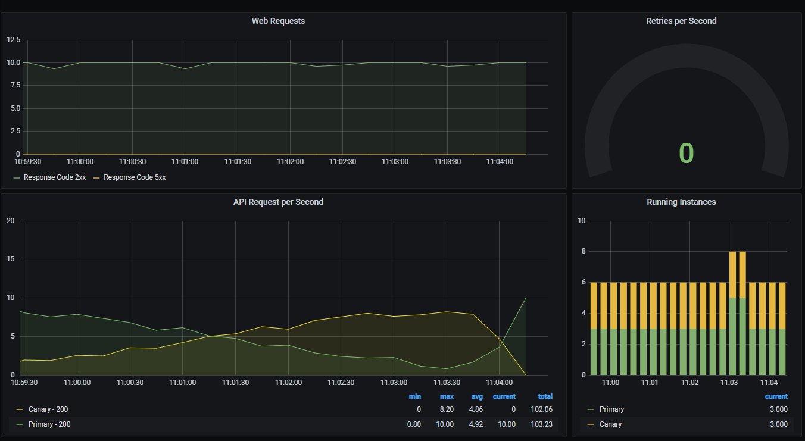

import Tabs from '@theme/Tabs';
import TabItem from '@theme/TabItem';

While not necessary for the operation of the Canary a simple dashboard provides you with information
related to your application. The dashboard shows simple information such as the number of requests and 
status codes for the `web` service along with detailed request information on the `api`.



If you are using either the local, the GCP, or the manual setup environments then Grafana has been
configured to use sidecar dashboards. This allows you to load a dashboard using a `Config` map that 
has the annotation `grafana_dashboard: "1"`.

```yaml
---
apiVersion: v1
kind: ConfigMap
metadata:
  name: canary-dashboard
  labels:
     grafana_dashboard: "1"
data:
  canary.json: |
    {
      "annotations": {
        "list": [
          {
            "builtIn": 1,
            "datasource": "-- Grafana --",
            "enable": true,
            "hide": true,
            "iconColor": "rgba(0, 211, 255, 1)",
            "name": "Annotations & Alerts",
            "type": "dashboard"
          }
```

<Tabs
  className="unique-tabs"
  groupId="environment"
  defaultValue="shipyard"
  values={[
    {label: 'Shipyard', value: 'shipyard'},
    {label: 'External Cluster', value: 'external'},
  ]}>
<TabItem value="shipyard">

If you are running the application in Docker using Shipyard, you can run the following command in the terminal below to create the dashboard in Grafana.

```shell
kubectl apply -f ./dashboard.yaml
```

<p>
<Terminal target="tools.container.shipyard.run" shell="/bin/bash" workdir="/app" user="root" expanded />
</p>

It will take a few second for Grafana to recognise the deployed ConfigMap and create the dashboard. You can then open the dashboard in your browser using the following link:

[http://localhost:8080/d/irtYjefGk/canary?orgId=1&refresh=10s](http://localhost:8080/d/irtYjefGk/canary?orgId=1&refresh=10s)

Using the username: `admin` and password: `admin`

</TabItem>
<TabItem value="external">

In your terminal run the following command to add the Consul config entries to Kubernetes.

```shell
kubectl apply -f ./app/dashboard.yaml
```

When you log into your Grafana server you will see a dashboard called Canary, if you click on this dashboard
you will see the traffic sent to the Web application and the upstream calls to the API.

</TabItem>
</Tabs>

Let's now modify the API deployment and see a Canary in action.